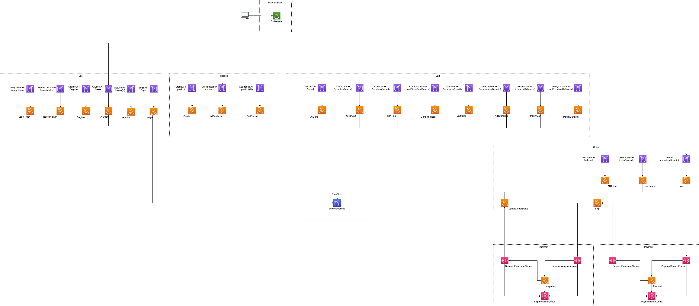

# ACME Serverless Fitness Shop

> Serverless and Fitness, because combining two amazing things can only lead to more amazing things

## Getting Started

These instructions will allow you to run entire ACME Serverless Fitness Shop

The ACME Serverless Fitness Shop contains seven different domains of service:

* [Shipment](https://github.com/retgits/acme-serverless-shipment)
* [Payment](https://github.com/retgits/acme-serverless-payment)
* [Order](https://github.com/retgits/acme-serverless-order)
* [Cart](https://github.com/retgits/acme-serverless-cart)
* [Catalog](https://github.com/retgits/acme-serverless-catalog)
* [User](https://github.com/retgits/acme-serverless-user)
* [Point-of-Sales](https://github.com/retgits/acme-serverless-pos)

To get deploy the services, you can follow the instructions for

| [AWS](./deploy/lambda/README.md)                  | [Google Cloud Platform](./deploy/cloudrun/README.md) |
|---------------------------------------------------|------------------------------------------------------|
| Using AWS Lambda, Amazon SQS, and Amazon DynamoDB | Using Google Cloud Run and MongoDB                   |

## Overview

The diagram shows how the services in the different domains work together. The architecture above shows the Amazon Simple Queue Service deployment option

## Contributing

Pull requests are welcome in their individual repositories. For major changes or questions, please open [an issue](https://github.com/retgits/acme-serverless/issues) first to discuss what you would like to change.

## License

See the [LICENSE](./LICENSE) file in the repository.
