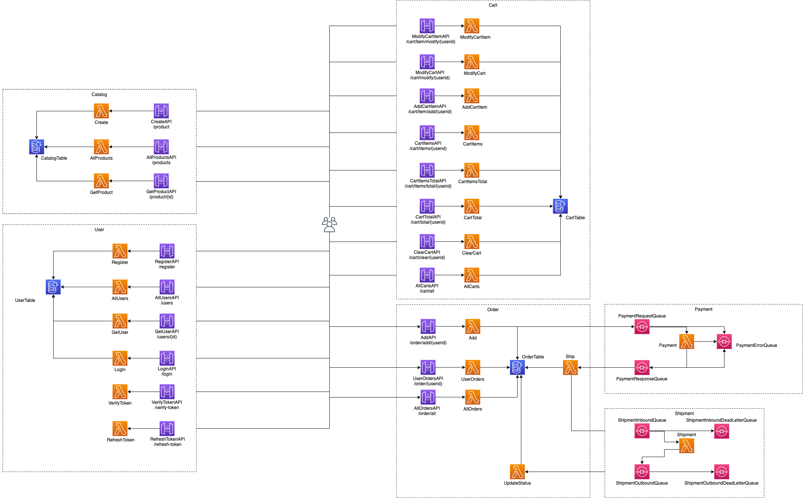

# ACME Serverless Fitness Shop

> Serverless and Fitness, because combining two amazing things can only lead to more amazing things

## Getting Started

These instructions will allow you to run entire ACME Serverless Fitness Shop

The ACME Serverless Fitness Shop contains seven different domains of service:

* [Shipment](https://github.com/retgits/acme-serverless-shipment)
* [Payment](https://github.com/retgits/acme-serverless-payment)
* [Order](https://github.com/retgits/acme-serverless-order)
* [Cart](https://github.com/retgits/acme-serverless-cart)
* [Catalog](https://github.com/retgits/acme-serverless-catalog)
* [User](https://github.com/retgits/acme-serverless-user)
* [Point-of-Sales](https://github.com/retgits/acme-serverless-pos)

To get started you'll need:

* [Go (at least Go 1.12)](https://golang.org/dl/);
* [An AWS Account](https://portal.aws.amazon.com/billing/signup);
* The _vuln_ targets for Make and Mage rely on the [Snyk](http://snyk.io/) CLI.
* The services use [Sentry.io](https://sentry.io) for tracing and error reporting

Each of the repositories contains the source code, data structures (if needed), and deployment scripts to deploy the different domains to AWS.

## Supported AWS Services

### Data Store

* [Amazon DynamoDB](https://aws.amazon.com/dynamodb/): You can use the makefile in the [dynamodb](./dynamodb) folder to create the DynamoDB table. The command you need to run is `make -f Makefile.dynamodb deploy`.

To start your journey off with random data, you can use the [`Makefile.dynamodb`](./dynamodb/Makefile.dynamodb) as well. The `seed` target will add seed data (from the various `data.json` files) into Amazon DynamoDB. To generate your own data, you can use [Mockaroo](https://www.mockaroo.com/) and import the `schema.json` files to start off.

### Eventing

* [Amazon EventBridge](https://aws.amazon.com/eventbridge/): Each of the domains that supports Amazon EventBridge will have instructions and sources how to run the ACME Serverless Fitness Shop using Amazon EventBridge;
* [Amazon Simple Queue Service](https://aws.amazon.com/sqs/): Each of the domains that supports Amazon Simple Queue Service will have instructions and sources how to run the ACME Serverless Fitness Shop using Amazon Simple Queue Service;
* [Amazon API Gateway](https://aws.amazon.com/api-gateway/) _(only when there are public APIs available)_

#### Testing EventBridge

You can test the function from the [AWS Lambda Console](https://console.aws.amazon.com/lambda/home) using the test data from the files in [eventbridge](./eventbridge/). To send a message to the event bus, you can use the Go app in `./eventbridge` and run

```bash
go run main.go -event=<any of the files existing in the folder of the specific service> -location=<location on disk of the eventbridge folder> -bus=<name of the custom bus> -service=<name of the service>
```

#### Testing SQS

To send a message to an SQS queue using the test data from the files in [sqs](./sqs/), you can use the Go app in `./sqs` and run

```bash
go run main.go -event=<any of the files existing in the folder of the specific service> -location=<location on disk of the sqs folder> -queue=<url of the sqs queue> -service=<name of the service>
```

If you want to test from the [AWS Lambda Console](https://console.aws.amazon.com/lambda/home), you'll have to wrap the test data in a SQS record envelop:

```json
{
  "Records": [
    {
      "messageId": "19dd0b57-b21e-4ac1-bd88-01bbb068cb78",
      "receiptHandle": "MessageReceiptHandle",
      "body": "", // This is where the data, an escaped JSON string, should be pasted
      "attributes": {
        "ApproximateReceiveCount": "1",
        "SentTimestamp": "1523232000000",
        "SenderId": "123456789012",
        "ApproximateFirstReceiveTimestamp": "1523232000001"
      },
      "messageAttributes": {},
      "md5OfBody": "7b270e59b47ff90a553787216d55d91d",
      "eventSource": "aws:sqs",
      "eventSourceARN": "arn:aws:sqs:us-east-1:123456789012:MyQueue",
      "awsRegion": "us-east-1"
    }
  ]
}
```

### Hosting

* The Point-of-Sales app can be hosted on [Amazon S3](https://aws.amazon.com/s3).

## Overview



The diagram shows how the services in the different domains work together. The architecture above shows the Amazon Simple Queue Service deployment option

## Contributing

Pull requests are welcome in their individual repositories. For major changes or questions, please open [an issue](https://github.com/retgits/acme-serverless/issues) first to discuss what you would like to change.

## License

See the [LICENSE](./LICENSE) file in the repository.
