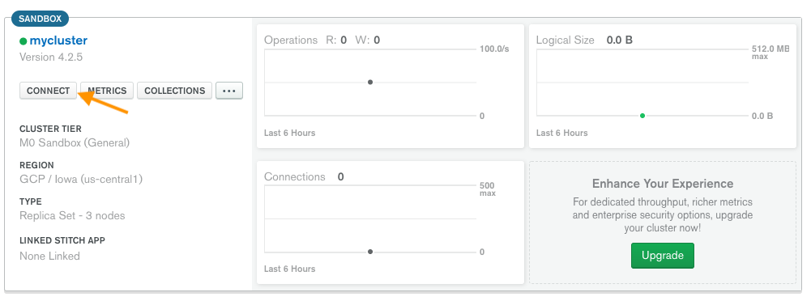
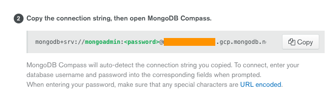
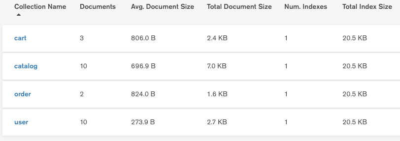
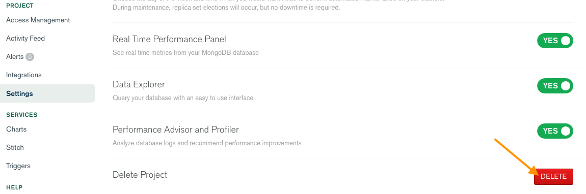

# ACME Serverless Fitness Store on Google Cloud Run

Serverless is more than just Function-as-a-Service. There are many different forms to build and deploy serverless applications and one of the is using containers on [Google Cloud Run](https://cloud.google.com/run/). This tutorial walks you through setting up the services of the ACME Serverless Fitness Shop.

## Prerequisites

This tutorial leverages [Google Cloud Platform](https://cloud.google.com/). Sign up [here](https://cloud.google.com/free/) for $300 in free credits. The data for the ACME Serverless Fitness Shop is stored in [MongoDB](https://mongodb.com). Sign up [here](https://www.mongodb.com/cloud/atlas/register) to set up a free MongoDB cluster using MongoDB Atlas.

*NOTE: While you're deploying to Google Cloud Run in this tutorial, you can use the docker images to run on your own machine or any other Kubernetes cluster too.*

To enable error reporting, you'll need a [Sentry.io account](https://sentry.io) and to get performance stats, you'll need a [Wavefront account](https://www.wavefront.com/sign-up/) and the [Wavefront API key](https://docs.wavefront.com/wavefront_api.html) for your account.

This tutorial assumes a default Google Cloud Run region has been configured.

If you are using the `gcloud` command-line tool for the first time init is the easiest way to do this:

```bash
gcloud init
```

Then be sure to authorize gcloud to access the Cloud Platform with your Google user credentials:

```bash
gcloud auth login
```

Next, set a default region for Google Cloud run:

```bash
gcloud config set run/region us-west1
```

Finally, set a default platform type for Google Cloud run:

```bash
gcloud config set run/platform managed
```

## Step 1: MongoDB Atlas

To create a MongoDB cluster in Atlas, follow the steps after you've signed up choosing *Google Cloud Platform* as the cloud provider. When you choose an `M0` type cluster and you're okay that no backups are made (which is totally fine for this tutorial), you're able to create a free cluster. After the cluster is created, click the "*connect*" button to set up a user.



The IP address that Google Cloud Run will use to connect to MongoDB will vary so the whitelist for IP addresses must contain `0.0.0.0`. The next step is to set up a user. This user will be used to seed data (and create the *acmeserverless* database) and to connect from Google Cloud Run. Finally, you're able to choose a connection method. To see the connection string, choose *Connect using MongoDB Compass*.



The connection string will be `mongodb+srv://<username>:<password>@<cluster name>-<random postfix>.gcp.mongodb.net/test`

## Step 2: Seeding MongoDB

To seed MongoDB with random data, you can use the Go app in the [mongodb/seed](../mongodb/seed) directory.

```bash
## Clone the repository
git clone https://github.com/retgits/acme-serverless

## Get the dependencies for the app (these dependencies are also used for other services in the ACME Serverless Fitness Shop)
go get ./...

## Change to the seed directory
cd mongodb/seed

## Run the seed program
go run main.go -username=<username> -password=<password> -hostname=<cluster name>-<random postfix>.gcp.mongodb.net
```

## Step 3: (Optional) Validate the data using MongoDB Compass

[MongoDB compass](https://www.mongodb.com/download-center/compass), is a GUI for MongoDB. After you've downloaded it for your operating system, you can connect to your cluster using the connection string created earlier. Once you log in, you'll see a "*acmeserverless*" database. In that database, there are four collections.



## Step 4: Build the containers

While you can use Google Cloud Build to build the Docker containers, this tutorial uses the [`docker build`](https://docs.docker.com/engine/reference/commandline/build/) command.

If you have not yet configured Docker to use the gcloud command-line tool to authenticate requests to Container Registry, do so now using the command:

```bash
gcloud auth configure-docker
```

Throughout the rest of the tutorial, you'll need the **PROJECT_ID** of your default GCP project. You can view your project ID by running the command `gcloud config get-value project`. To create an environment variable with the value of your default project ID, you can run the command:

```bash
export PROJECT_ID=`gcloud config get-value project`
```

Google Cloud Run (fully managed) only supports container images stored in Container Registry or Artifact Registry. In this tutorial you'll make use of Google Container Registry to store the containers.

### Step 4.1: Build the Cart service

> A cart service, because what is a shop without a cart to put stuff in?

The Cart service is to keep track of carts and items in the different carts.

```bash
## Clone the project
git clone https://github.com/retgits/acme-serverless-cart

## Change to the cart directory
cd acme-serverless-cart

## Set an environment variable for the version of the cart service
VERSION=`git describe --tags --always --dirty="-dev"`

## Build the container
docker build -f ./cmd/cloudrun-cart-http/Dockerfile . -t gcr.io/$PROJECT_ID/cart:$VERSION

## Push the container to Google Container Registry
docker push gcr.io/$PROJECT_ID/cart:$VERSION

## Change back to the parent directory
cd ..
```

### Step 4.2: Build the Catalog service

> A catalog service, because what is a shop without a catalog to show off our awesome red pants?

The Catalog service is to register and serve the catalog of items sold by the shop.

```bash
## Clone the project
git clone https://github.com/retgits/acme-serverless-catalog

## Change to the catalog directory
cd acme-serverless-catalog

## Set an environment variable for the version of the catalog service
VERSION=`git describe --tags --always --dirty="-dev"`

## Build the container
docker build -f ./cmd/cloudrun-catalog-http/Dockerfile . -t gcr.io/$PROJECT_ID/catalog:$VERSION

## Push the container to Google Container Registry
docker push gcr.io/$PROJECT_ID/catalog:$VERSION

## Change back to the parent directory
cd ..
```

### Step 4.3: Build the Order service

> An order service, because what is a shop without actual orders to be shipped?

The Order service is to interact with the catalog, front-end, and make calls to the order services.

```bash
## Clone the project
git clone https://github.com/retgits/acme-serverless-order

## Change to the order directory
cd acme-serverless-order

## Set an environment variable for the version of the order service
VERSION=`git describe --tags --always --dirty="-dev"`

## Build the container
docker build -f ./cmd/cloudrun-order-http/Dockerfile . -t gcr.io/$PROJECT_ID/order:$VERSION

## Push the container to Google Container Registry
docker push gcr.io/$PROJECT_ID/order:$VERSION

## Change back to the parent directory
cd ..
```

### Step 4.4: Build the Payment service

> A payment service, because nothing in life is really free...

The Payment service is to validate credit card payments. Currently the only validation performed is whether the card is acceptable.

```bash
## Clone the project
git clone https://github.com/retgits/acme-serverless-payment

## Change to the payment directory
cd acme-serverless-payment

## Set an environment variable for the version of the payment service
VERSION=`git describe --tags --always --dirty="-dev"`

## Build the container
docker build -f ./cmd/cloudrun-payment-http/Dockerfile . -t gcr.io/$PROJECT_ID/payment:$VERSION

## Push the container to Google Container Registry
docker push gcr.io/$PROJECT_ID/payment:$VERSION

## Change back to the parent directory
cd ..
```

### Step 4.5: Build the Shipment service

> A shipping service, because what is a shop without a way to ship your purchases?

The Shipping service is, as the name implies, to ship products using a wide variety of shipping suppliers.

```bash
## Clone the project
git clone https://github.com/retgits/acme-serverless-shipment

## Change to the shipment directory
cd acme-serverless-shipment

## Set an environment variable for the version of the shipment service
VERSION=`git describe --tags --always --dirty="-dev"`

## Build the container
docker build -f ./cmd/cloudrun-shipment-http/Dockerfile . -t gcr.io/$PROJECT_ID/shipment:$VERSION

## Push the container to Google Container Registry
docker push gcr.io/$PROJECT_ID/shipment:$VERSION

## Change back to the parent directory
cd ..
```

### Step 4.6: Build the User service

> A user service, because what is a shop without users to buy our awesome red pants?

The User service is to register and authenticate users using JWT tokens.

```bash
## Clone the project
git clone https://github.com/retgits/acme-serverless-user

## Change to the user directory
cd acme-serverless-user

## Set an environment variable for the version of the user service
VERSION=`git describe --tags --always --dirty="-dev"`

## Build the container
docker build -f ./cmd/cloudrun-user-http/Dockerfile . -t gcr.io/$PROJECT_ID/user:$VERSION

## Push the container to Google Container Registry
docker push gcr.io/$PROJECT_ID/user:$VERSION

## Change back to the parent directory
cd ..
```

## Step 5: Deploy the services

In order to deploy to Cloud Run (fully managed), you must have the Owner or Editor role, or both the Cloud Run Admin and Service Account User roles, or any custom role that includes this [specific list of permissions](https://cloud.google.com/run/docs/reference/iam/roles?authuser=1#additional-configuration).Deploying to a service for the first time creates its first revision (revisions are *immutable*).

All services rely on a set of environment variables to either connect to MongoDB, Sentry, or Wavefront, or to report the status:

| Env Var           | Description                             | Value                                                                                                                       |
|-------------------|-----------------------------------------|-----------------------------------------------------------------------------------------------------------------------------|
| `SENTRY_DSN`      | The DSN to connect to Sentry            | `https://<id>@sentry.io/<id>` (see the [Sentry docs](https://docs.sentry.io/) for more info how to get your DSN)            |
| `VERSION`         | The version you're running              | `0.3.0` (the current release of the ACME Serverless Fitness Shop for Google Cloud Run)                                      |
| `STAGE`           | The environment in which you're running | `dev`                                                                                                                       |
| `WAVEFRONT_TOKEN` | The token to connect to Wavefront       | `<token>` (see the [Wavefront docs](https://docs.wavefront.com/wavefront_api.html) for more info how to get your API token) |
| `WAVEFRONT_URL`   | The URL to connect to Wavefront         | `https://<server>.wavefront.com`                                                                                            |
| `MONGO_USERNAME`  | The username to connect to MongoDB      | The username you created in `step 1`                                                                                        |
| `MONGO_PASSWORD`  | The password to connect to MongoDB      | The password you created in `step 1`                                                                                        |
| `MONGO_HOSTNAME`  | The hostname of the MongoDB server      | The hostname of the instance you created in `step 1` (like `<cluster>-<suffix>.gcp.mongodb.net`)                            |

Google Cloud Run allows you to set labels, which make the management of your applications a lot easier. For this tutorial you'll add six labels

| Label   | Description                                 | Value            |
|---------|---------------------------------------------|------------------|
| author  | The name of the person deploying it         | `<your name>`    |
| feature | The name of the app this service belongs to | `acmeserverless` |
| team    | The team the person deploying it is on      | `<your team>`    |
| version | The current version of the app              | `v0_3_0`         |
| stage   | The environment in which you're running     | `dev`            |
| type    | The type of service this is                 | `backend`        |

With the command below, you can set the environment variables and labels to their correct values before deploying:

```bash
export SENTRY_DSN=<value>
export VERSION=0.3.0
export STAGE=dev
export WAVEFRONT_TOKEN=<value>
export WAVEFRONT_URL=<value>
export MONGO_USERNAME=<value>
export MONGO_PASSWORD=<value>
export MONGO_HOSTNAME=<value>
export AUTHOR=`whoami`
export FEATURE=acmeserverless
export TEAM=<value>
export LVERSION=v0_3_0
export TYPE=backend
```

## Step 5.1: Deploy the Payment service

```bash
## Get the name of the image of the payment service
PAYMENT_IMAGE=`docker images --filter=reference='gcr.io/*/payment' --format "{{.Repository}}:{{.Tag}}"`

## Deploy the service to Google Cloud Run
gcloud run deploy payment --image=$PAYMENT_IMAGE --set-env-vars=SENTRY_DSN=$SENTRY_DSN,VERSION=$VERSION,STAGE=$STAGE,WAVEFRONT_TOKEN=$WAVEFRONT_TOKEN,WAVEFRONT_URL=$WAVEFRONT_URL,MONGO_USERNAME=$MONGO_USERNAME,MONGO_PASSWORD=$MONGO_PASSWORD,MONGO_HOSTNAME=$MONGO_HOSTNAME --labels=author=$AUTHOR,feature=$FEATURE,team=$TEAM,version=$LVERSION,stage=$STAGE,type=$TYPE --allow-unauthenticated
```

## Step 5.2: Deploy the Shipment service

```bash
## Get the name of the image of the shipment service
SHIPMENT_IMAGE=`docker images --filter=reference='gcr.io/*/shipment' --format "{{.Repository}}:{{.Tag}}"`

## Deploy the service to Google Cloud Run
gcloud run deploy shipment --image=$SHIPMENT_IMAGE --set-env-vars=SENTRY_DSN=$SENTRY_DSN,VERSION=$VERSION,STAGE=$STAGE,WAVEFRONT_TOKEN=$WAVEFRONT_TOKEN,WAVEFRONT_URL=$WAVEFRONT_URL,MONGO_USERNAME=$MONGO_USERNAME,MONGO_PASSWORD=$MONGO_PASSWORD,MONGO_HOSTNAME=$MONGO_HOSTNAME,ORDER_URL=$URL/ship --labels=author=$AUTHOR,feature=$FEATURE,team=$TEAM,version=$LVERSION,stage=$STAGE,type=$TYPE --allow-unauthenticated
```

## Step 5.3: Deploy the Cart service

```bash
## Get the name of the image of the cart service
CART_IMAGE=`docker images --filter=reference='gcr.io/*/cart' --format "{{.Repository}}:{{.Tag}}"`

## Deploy the service to Google Cloud Run
gcloud run deploy cart --image=$CART_IMAGE --set-env-vars=SENTRY_DSN=$SENTRY_DSN,VERSION=$VERSION,STAGE=$STAGE,WAVEFRONT_TOKEN=$WAVEFRONT_TOKEN,WAVEFRONT_URL=$WAVEFRONT_URL,MONGO_USERNAME=$MONGO_USERNAME,MONGO_PASSWORD=$MONGO_PASSWORD,MONGO_HOSTNAME=$MONGO_HOSTNAME --labels=author=$AUTHOR,feature=$FEATURE,team=$TEAM,version=$LVERSION,stage=$STAGE,type=$TYPE --allow-unauthenticated
```

## Step 5.4: Deploy the Catalog service

```bash
## Get the name of the image of the catalog service
CATALOG_IMAGE=`docker images --filter=reference='gcr.io/*/catalog' --format "{{.Repository}}:{{.Tag}}"`

## Deploy the service to Google Cloud Run
gcloud run deploy catalog --image=$CATALOG_IMAGE --set-env-vars=SENTRY_DSN=$SENTRY_DSN,VERSION=$VERSION,STAGE=$STAGE,WAVEFRONT_TOKEN=$WAVEFRONT_TOKEN,WAVEFRONT_URL=$WAVEFRONT_URL,MONGO_USERNAME=$MONGO_USERNAME,MONGO_PASSWORD=$MONGO_PASSWORD,MONGO_HOSTNAME=$MONGO_HOSTNAME --labels=author=$AUTHOR,feature=$FEATURE,team=$TEAM,version=$LVERSION,stage=$STAGE,type=$TYPE --allow-unauthenticated
```

## Step 5.5: Deploy the User service

```bash
## Get the name of the image of the user service
USER_IMAGE=`docker images --filter=reference='gcr.io/*/user' --format "{{.Repository}}:{{.Tag}}"`

## Deploy the service to Google Cloud Run
gcloud run deploy user --image=$USER_IMAGE --set-env-vars=SENTRY_DSN=$SENTRY_DSN,VERSION=$VERSION,STAGE=$STAGE,WAVEFRONT_TOKEN=$WAVEFRONT_TOKEN,WAVEFRONT_URL=$WAVEFRONT_URL,MONGO_USERNAME=$MONGO_USERNAME,MONGO_PASSWORD=$MONGO_PASSWORD,MONGO_HOSTNAME=$MONGO_HOSTNAME --labels=author=$AUTHOR,feature=$FEATURE,team=$TEAM,version=$LVERSION,stage=$STAGE,type=$TYPE --allow-unauthenticated
```

## Step 5.6: Deploy the Order service

```bash
## Get the name of the image of the order service
ORDER_IMAGE=`docker images --filter=reference='gcr.io/*/order' --format "{{.Repository}}:{{.Tag}}"`

## Get the URL of the payment service
PAYMENT_URL=`gcloud run services describe payment --format 'value(status.address.url)'`/pay

## Get the URL of the shipment service
SHIPMENT_URL=`gcloud run services describe shipment --format 'value(status.address.url)'`/ship

## Deploy the service to Google Cloud Run
gcloud run deploy order --image=$ORDER_IMAGE --set-env-vars=SENTRY_DSN=$SENTRY_DSN,VERSION=$VERSION,STAGE=$STAGE,WAVEFRONT_TOKEN=$WAVEFRONT_TOKEN,WAVEFRONT_URL=$WAVEFRONT_URL,MONGO_USERNAME=$MONGO_USERNAME,MONGO_PASSWORD=$MONGO_PASSWORD,MONGO_HOSTNAME=$MONGO_HOSTNAME,PAYMENT_URL=$PAYMENT_URL,SHIPPING_URL=$SHIPMENT_URL --labels=author=$AUTHOR,feature=$FEATURE,team=$TEAM,version=$LVERSION,stage=$STAGE,type=$TYPE --allow-unauthenticated

## Update the order shipment service with the URL of the order service
ORDER_URL=`gcloud run services describe order --format 'value(status.address.url)'`/order/update
gcloud run deploy shipment --image=$SHIPMENT_IMAGE --update-env-vars ORDER_URL=$ORDER_URL
```

## Step 6: Test the services

After the deployments and updates are completes, you can use the below cURL commands to test the functions.

### Step 6.1: Test the Payment service

```bash
URL=`gcloud run services describe payment --format 'value(status.address.url)'`
```

```bash
## Payment success
curl --request POST \
  --url $URL/pay \
  --header 'content-type: application/json' \
  --data '{
	"metadata": {
		"domain": "payment",
		"source": "insomnia",
		"type": "test",
		"status": "success"
	},
	"data": {
		"orderID": "1234",
		"card": {
			"number": "378282246310005",
			"expirymonth": 1,
			"expiryyear": 2022,
			"cvv": "1234"
		},
		"total": "5678"
	}
}'

## Payment failure
curl --request POST \
  --url $URL/pay \
  --header 'content-type: application/json' \
  --data '{
	"metadata": {
		"domain": "payment",
		"source": "insomnia",
		"type": "test",
		"status": "success"
	},
	"data": {
		"orderID": "1234",
		"card": {
			"number": "378282246310005",
			"expirymonth": 1,
			"expiryyear": 2019,
			"cvv": "1234"
		},
		"total": "5678"
	}
}'
```

### Step 6.2: Test the Shipment service

```bash
URL=`gcloud run services describe shipment --format 'value(status.address.url)'`
```

```bash
## Send shipment
curl --request POST \
  --url $URL/ship \
  --header 'content-type: application/json' \
  --data '{
	"metadata": {
		"domain": "shipment",
		"source": "insomnia",
		"type": "test",
		"status": "success"
	},
	"data": {
		"orderID": "1234",
		"delivery": "USPS"
	}
}'
```

### Step 6.3: Test the Cart service

```bash
URL=`gcloud run services describe cart --format 'value(status.address.url)'`
```

```bash
## Get all carts
curl --request GET \
  --url $URL/cart/all

## Add item to cart
curl --request POST \
  --url $URL/cart/item/add/499fd0be-63c1-4a24-bcdf-46694671b77f \
  --header 'content-type: application/json' \
  --data '{
    "description": "fitband for any age ",
    "itemid": "sdfsdfsfs",
    "name": "fitband",
    "price": 4.5,
    "quantity": 1
}'
```

### Step 6.4: Test the Catalog service

```bash
URL=`gcloud run services describe catalog --format 'value(status.address.url)'`
```

```bash
## Get product details
curl --request GET \
  --url $URL/products/050b7bdc-e993-4884-bb60-18323f9278dd

## Add new product
curl --request POST \
  --url $URL/product \
  --header 'content-type: application/json' \
  --data '{
    "name": "Tracker",
    "shortDescription": "Limited Edition Tracker",
    "description": "Limited edition Tracker with longer description",
    "imageurl1": "/static/images/tracker_square.jpg",
    "imageurl2": "/static/images/tracker_thumb2.jpg",
    "imageurl3": "/static/images/tracker_thumb3.jpg",
    "price": 149.99,
    "tags": [
        "tracker"
    ]
}'
```

### Step 6.5: Test the Order service

```bash
URL=`gcloud run services describe order --format 'value(status.address.url)'`
```

```bash
## Submit new order
curl --request POST \
  --url $URL/order/add/bbuttner0 \
  --header 'content-type: application/json' \
  --data '{
  "_id": "fa21f430-310a-4077-8280-2f091804e280",
  "status": "pending payment",
  "userid": "bbuttner0",
  "firstname": "Basia",
  "lastname": "Buttner",
  "address": {
    "street": "Jenna",
    "city": "Fresno",
    "zip": "93704",
    "state": "CA",
    "country": "United States"
  },
  "email": "bbuttner0@someplace.com",
  "delivery": "usps",
  "card": {
    "Type": "Visa",
    "Number": "4222222222222",
    "ExpiryMonth": 7,
    "ExpiryYear": 2021,
    "CVV": "672"
  },
  "cart": [
    {
      "id": "09c0a567-812e-49c1-9f63-e0f619db6466",
      "description": "arcu adipiscing molestie hendrerit at vulputate vitae nisl aenean lectus pellentesque eget nunc",
      "quantity": 5,
      "price": 6.3
    },
    {
      "id": "3a91c3b5-6273-4c86-82b9-896044ebde36",
      "description": "aliquet pulvinar sed nisl nunc rhoncus dui vel sem sed sagittis nam congue risus semper porta volutpat",
      "quantity": 5,
      "price": 7.6
    }
  ],
  "total": "1402"
}'

## Get all orders
curl --request GET \
  --url $URL/order/all
```

### Step 6.6: Test the User service

```bash
URL=`gcloud run services describe user --format 'value(status.address.url)'`
```

```bash
## Add a new user
curl --request POST \
  --url $URL/register \
  --header 'content-type: application/json' \
  --data '{
    "username":"peterp",
    "password":"vmware1!",
    "firstname":"amazing",
    "lastname":"spiderman",
    "email":"peterp@acmefitness.com"
}'

## Get the JWT tokens
curl --request POST \
  --url $URL/login \
  --header 'content-type: application/json' \
  --data '{
	"username": "peterp",
	"password": "vmware1!"
}'
```

## Step 7: Clean up

To remove all the functions, you can run:

```bash
gcloud run service delete payment
gcloud run service delete shipment
gcloud run service delete cart
gcloud run service delete catalog
gcloud run service delete order
gcloud run service delete user
```

The MongoDB Atlas cluster won't charge you, assuming you haven't selected any add-ons during the creation, but if you still want to delete all the data you can delete the project from the "**Project -> Settings**" menu.


